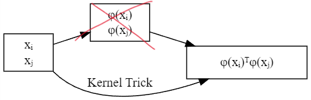

## Introduction

- TODO: Add more text to the introduction. - Kellen Nankervis

As we discussed in notes 11 suport vector machines are a powerful tool for classification. They work by finding the hyperplane that maximizes the margin between the two classes. The kernel trick is a way to transform the data into a higher dimensional space where the data becomes linearly separable. This is done by using a kernel function to calculate the dot product of the transformed data without actually transforming the data. This allows us to use the SVM algorithm to classify data that is not linearly separable in the original space. In this project we will explore the radial basis function kernel and how it is an extremely powerful tool for classifying data that could not be classified with a linear kernel or other data with a extremely curved decision boundary.
```{r}
reticulate::py_install("sklearn")
```

Non-linear decision boundary:
```{python, echo=F, cache=T}
import matplotlib.pyplot as plt
import numpy as np

template = np.array(
    [
        [1, 1],
        [1.1, 1.1],
        [0.9, 0.9],
        [1.1, 0.9],
        [0.9, 1.1]
    ]
)

X = np.vstack(
    [
        template + np.array([-3,-3]), template + np.array([-1,-3]), template + np.array([1,-3]),
        template + np.array([-3,-1]), template + np.array([-1,-1]), template + np.array([1,-1]),
        template + np.array([-3,1]), template + np.array([-1,1]), template + np.array([1,1])
    ]
)

y = np.array(([0] * 5 + [1] * 5) * 4 + [0] * 5)

# Plotting settings
fig, ax = plt.subplots(figsize=(4, 3))
x_min, x_max, y_min, y_max = -3, 3, -3, 3
ax.set(xlim=(x_min, x_max), ylim=(y_min, y_max))

# Plot samples by color and add legend
scatter = ax.scatter(X[:, 0], X[:, 1], s=150, c=y, label=y, edgecolors="k")
ax.legend(*scatter.legend_elements(), loc="upper right", title="Classes")
ax.set_title("Samples in two-dimensional feature space")
_ = plt.show()
```

```{python, echo=F, cache=T}
from sklearn import svm
from sklearn.inspection import DecisionBoundaryDisplay


def plot_with_boundary(kernel, kernel_label=None):
    if kernel_label is None:
      kernel_label = kernel

    # Train the SVC
    clf = svm.SVC(kernel=kernel, gamma=1).fit(X, y)

    # Settings for plotting
    _, ax = plt.subplots(figsize=(4, 3))
    x_min, x_max, y_min, y_max = -3, 3, -3, 3
    ax.set(xlim=(x_min, x_max), ylim=(y_min, y_max))

    # Plot decision boundary and margins
    common_params = {"estimator": clf, "X": X, "ax": ax}
    DecisionBoundaryDisplay.from_estimator(
        **common_params,
        response_method="predict",
        plot_method="pcolormesh",
        alpha=0.3,
    )
    DecisionBoundaryDisplay.from_estimator(
        **common_params,
        response_method="decision_function",
        plot_method="contour",
        levels=[-1, 0, 1],
        colors=["k", "k", "k"],
        linestyles=["--", "-", "--"],
    )

    
      # Plot bigger circles around samples that serve as support vectors
    ax.scatter(
        X[clf.support_][:, 0],
        X[clf.support_][:, 1],
        s=250,
        facecolors="none",
        edgecolors="k",
    )
    # Plot samples by color and add legend
    ax.scatter(X[:, 0], X[:, 1], c=y, s=150, edgecolors="k")
    ax.legend(*scatter.legend_elements(), loc="upper right", title="Classes")
    ax.set_title(f" Decision boundaries of {kernel_label} kernel in SVC")

    _ = plt.show()
    
def power_kernel(p):
    return lambda A, B: (A @ B.T) ** p

def poly_kernel(p):
    return lambda A, B: (A @ B.T + 1 ) ** p
```

SVM epic fail:
```{python, echo=F, cache=T}
plot_with_boundary("linear")
```


## Dual Problem
For the Support Vector Machine algorithm, our goal is to find a $\beta$ and $c$ under the following optimization objective:
\begin{align*}
\underset{\boldsymbol{\beta}, c}{\text{minimize }} & \Vert\boldsymbol{\beta}\Vert^2_2\\
\text{subject to } & y_i(\boldsymbol{\beta} \cdot\xb_i-c)\ge 1 \text{ for all } i
\end{align*}

For convenience, let's divide our objective function by 2, which doesn't affect the results:

\begin{align*}
\underset{\boldsymbol{\beta}, c}{\text{minimize }} & \dfrac{1}{2}\Vert\boldsymbol{\beta}\Vert^2_2\\
\text{subject to } & y_i(\boldsymbol{\beta} \cdot\xb_i-c)\ge 1 \text{ for all } i
\end{align*}

Then we can find the [dual optimization problem](https://www.youtube.com/watch?v=uh1Dk68cfWs), using Lagrange Multipliers:

\begin{align*}
\underset{\boldsymbol{\lambda}}{\text{maximize }}\underset{\boldsymbol{\beta}, c}{\text{minimize }} 
L(\boldsymbol{\beta}, c, \boldsymbol{\lambda}) = \dfrac{1}{2}\Vert\boldsymbol{\beta}\Vert^2_2 - \sum_{i=1}^n \lambda_i \Big( y_i(\boldsymbol{\beta} \cdot\xb_i-c) - 1 \Big) 
\end{align*}

The dual problem will be satisfied when all partial derivatives are zero, Which leads us to the following results:

\begin{align*}
\dfrac{\partial{L}}{\partial{\boldsymbol{\beta}}} & 
= \boldsymbol{\beta} - \sum_{i=1}^n \lambda_i y_i \xb_i \overset{\text{set}}{=} 0 \iff
\boldsymbol{\beta} = \sum_{i=1}^n \lambda_i y_i \xb_i \\
\dfrac{\partial{L}}{\partial{\boldsymbol{\lambda}}} & = \sum_{i=1}^n y_i(\boldsymbol{\beta} \cdot\xb_i-c) - 1 \overset{\text{set}}{=} 0 \iff c = 
\dfrac{\sum_{i=1}^n y_i \boldsymbol{\beta} \cdot\xb_i-n}{\sum_{i=1}^n y_i} \\
\dfrac{\partial{L}}{\partial{c}} & = \sum_{i=1}^n \lambda_i y_i \overset{\text{set}}{=} 0 \iff \boldsymbol{\lambda} \cdot \boldsymbol{y} = 0
\end{align*}

Observe how $\boldsymbol{\beta}$ and $c$ can be derived from $\boldsymbol{\lambda}$, $\boldsymbol{y}$ and $X$. Substituting these results into the Lagrangian should lead to some nice results. Although, substituting for $c$ won't be necessary (it gets multiplied by zero). Then, replacing $\boldsymbol{\beta}$ in our Lagrangian yields:


\begin{align*}
L(\boldsymbol{\beta}, c, \boldsymbol{\lambda}) &= \dfrac{1}{2}\Vert\boldsymbol{\beta}\Vert^2_2 - \sum_{i=1}^n \lambda_i \Big( y_i(\boldsymbol{\beta} \cdot\xb_i-c) - 1 \Big)  \\
&= \dfrac{1}{2}\Vert\boldsymbol{\beta}\Vert^2_2 - \sum_{i=1}^n \lambda_i y_i\boldsymbol{\beta} \cdot\xb_i + c \sum_{i=1}^n \lambda_iy_i + \sum_{i=1}^n \lambda_i \\
&= \dfrac{1}{2}\Vert\sum_{j=1}^n \lambda_j y_j \xb_j\Vert^2_2  
- \sum_{i=1}^n \left( \sum_{j=1}^n \lambda_j y_j \xb_j\right) \cdot\Big(\lambda_i y_i\xb_i \Big) 
+ c \cdot 0 + \sum_{i=1}^n \lambda_i \\
&= \dfrac{1}{2} \left( \sum_{i=1}^n \lambda_i y_i \xb_i\right) \cdot \left( \sum_{j=1}^n \lambda_j y_j \xb_j\right) 
- \sum_{i=1}^n  \sum_{j=1}^n \left(\lambda_j y_j \xb_j\right) \cdot\left(\lambda_i y_i\xb_i\right) + \sum_{i=1}^n \lambda_i\\
&= \dfrac{1}{2} \sum_{i=1}^n \sum_{j=1}^n (\lambda_i y_i \xb_i) \cdot(\lambda_j y_j \xb_j) - \sum_{i=1}^n \sum_{j=1}^n (\lambda_i y_i \xb_i) \cdot(\lambda_j y_j \xb_j) +  \sum_{i=1}^n \lambda_i\\
&= -\dfrac{1}{2}\sum_{i=1}^n \sum_{j=1}^n \lambda_i\lambda_jy_iy_j\xb_i \cdot\xb_j + \sum_{i=1}^n\lambda_i\\
L(\boldsymbol{\beta}, c, \boldsymbol{\lambda}) &= \sum_{i=1}^n\lambda_i-\dfrac{1}{2}\sum_{i=1}^n \sum_{j=1}^n \lambda_i\lambda_jy_iy_j\xb_i \cdot\xb_j
\end{align*}


This shows a version of the Lagrangian that doesn't depend on $\boldsymbol{\beta}$ nor $c$, which means the optimization problem reduces to:

\begin{align*}
\underset{\boldsymbol{\lambda}}{\text{maximize }}L(\boldsymbol{\beta}, c, \boldsymbol{\lambda}) &= \sum_{i=1}^n\lambda_i-\dfrac{1}{2}\sum_{i=1}^n \sum_{j=1}^n \lambda_i\lambda_jy_iy_j\xb_i \cdot\xb_j 
\end{align*}

## Kernel Trick

But, why did we go through all that trouble? In this form, we can observe that the Lagrangian depends  on 3 components only:

- $\lambda_i$, an optimization artifact 
- $y_i$, a fixed "binary" variable 
- $\xb_i$, the features we're using to predict the class


Notice, $\xb_i$ is the only aspect of our model we can modify (via feature engineering). So, let $\phi(\xb)$ be our feature engineer transformation, then our Lagrangian becomes:
\begin{align*}
L(\boldsymbol{\beta}, c, \boldsymbol{\lambda}) &= \sum_{i=1}^n\lambda_i -\dfrac{1}{2}\sum_{i=1}^n \sum_{j=1}^n \lambda_i\lambda_jy_iy_j\phi(\xb_i) \cdot\phi(\xb_j) 
\end{align*}

From this we can observe that we don't really need to calculate $\phi(\xb)$, a function that finds $\phi(\xb_i) \cdot\phi(\xb_j)$ from $\xb_i$ and $\xb_j$ is good enough. We call that function a Kernel and denote it by $K(\xb_i, \xb_j)$. To avoid having complicated sub-indices, we'll relabel the arguments of $K$ to $\boldsymbol{a}$ and $\boldsymbol{b}$, so we'll have $K(\boldsymbol{a}, \boldsymbol{b})$. Finding the $\phi(\boldsymbol{a}) \cdot\phi(\boldsymbol{b})$, without having to calculate $\phi$  is what we call the **Kernel Trick**.



One of the simplest transformations we can investigate is $K_{Power(2)}(\boldsymbol{a}, \boldsymbol{b}) = (\boldsymbol{a} \cdot \boldsymbol{b})^2$

If we expand the dot product, we get: 

$K_{Power(2)}(\boldsymbol{a}, \boldsymbol{b}) = (a_1b_1 + a_2b_2 + \cdots + a_nb_n)^2$

Expanding the square, gives:
\begin{align*}
K_{Power(2)}(\boldsymbol{a}, \boldsymbol{b}) = & (a_1b_1)(a_1b_1) + (a_1b_1)(a_2b_2) + \cdots + (a_1b_1)(a_nb_n) + \\
& (a_2b_2)(a_1b_1) + (a_2b_2)(a_2b_2) + \cdots + (a_2b_2)(a_nb_n) + \\
& \hspace{1in} \vdots\\
& (a_nb_n)(a_1b_1) + (a_nb_n)(a_2b_2) + \cdots + (a_nb_n)(a_nb_n)\\\\
= & (a_1a_1)(b_1b_1) + (a_1a_2)(b_1b_2) + \cdots + (a_1a_n)(b_1b_n) + \\
& (a_2a_1)(b_2b_1) + (a_2a_2)(b_2b_2) + \cdots + (a_2a_n)(b_2b_n) + \\
& \hspace{1in} \vdots\\
& (a_na_1)(b_nb_1) + (a_na_2)(b_nb_2) + \cdots + (a_na_n)(b_nb_n)
\end{align*}

Observe that the expanded sum is equivalent to the dot product of the vectors containing all pair-wise interaction terms. So, in this case 

$$\phi_{Power(2)}(\boldsymbol{x}) = 
\begin{bmatrix}
x_1x_1 \\
x_1x_2 \\
\vdots \\ 
x_1x_n \\ 
x_2x_1 \\
x_2x_2 \\
\vdots \\ 
x_2x_n \\ 
\vdots \\
x_nx_1 \\
x_nx_2 \\
\vdots \\
x_nx_n
\end{bmatrix}
$$

and $K_{Power(2)}(\boldsymbol{a}, \boldsymbol{b}) = \phi_{Power(2)}(\boldsymbol{a}) \cdot \phi_{Power(2)}(\boldsymbol{b}) = (\boldsymbol{a} \cdot \boldsymbol{b})^2$. However, notice we don't have to compute $\phi_{Power(2)}$ if we take $K_{Power(2)}(\boldsymbol{a}, \boldsymbol{b}) = (\boldsymbol{a} \cdot \boldsymbol{b})^2$ instead.

```{python, echo=F, cache=T}
plot_with_boundary(power_kernel(2), "Power(2)")
```

Likewise, one can show that: 
\begin{align*}
K_{Power(3)}(\boldsymbol{a}, \boldsymbol{b}) = & (\boldsymbol{a} \cdot \boldsymbol{b})^3 \text{ corresponds to the transformation containing all 3-way interaction terms}\\
K_{Power(4)}(\boldsymbol{a}, \boldsymbol{b}) = & (\boldsymbol{a} \cdot \boldsymbol{b})^4 \text{ corresponds to the transformation containing all 4-way interaction terms}\\
&\hspace{1in}\vdots\\
K_{Power(n)}(\boldsymbol{a}, \boldsymbol{b}) = & (\boldsymbol{a} \cdot \boldsymbol{b})^n \text{ corresponds to the transformation containing all n-way interaction terms}
\end{align*}

```{python, echo=F, cache=T}
for i in range(3,6+1):
  plot_with_boundary(power_kernel(i), f"Power({i})")
```

```{python, echo=F, cache=T}
plot_with_boundary(power_kernel(50), "Power(50)")
```

However, in Applied Statistics we learned that whenever we include high order terms, we also want to include all lower level terms. So, let's inspect the following kernel:

$K_{Poly(2)}(\boldsymbol{a}, \boldsymbol{b}) = (\boldsymbol{a} \cdot \boldsymbol{b} + 1)^2 = \underset{\text{2-way}}{(\boldsymbol{a} \cdot \boldsymbol{b})^2} + \underset{\text{1-way}}{2(\boldsymbol{a} \cdot \boldsymbol{b})} + \underset{\text{0-way}}{1}$ 

So, $K_{Poly(2)}$ gives us the 2-way interaction terms and all the lower order terms. Likewise,  $K_{Poly(n)}= (\boldsymbol{a} \cdot \boldsymbol{b} + 1)^n$ gives us the n-way interaction terms and below, precisely what we wanted. This is also the polynomial kernel for SVM with $\gamma$ = 1.

```{python, echo=F, cache=T}
plot_with_boundary(poly_kernel(2), "Poly(2)")
```

```{python, echo=F, cache=T}
for i in range(3,6+1):
  plot_with_boundary(poly_kernel(i), f"Poly({i})")
```
```{python, echo=F, cache=T}
plot_with_boundary(poly_kernel(50), "Poly(50)")
```


This proposes an interesting conundrum: which n should we pick? We could try using using cross-validation. However, our friend ***Taylor*** might have a way of trying out all n values at the same time, while giving more weight to lower order terms than the higher order terms (following the principle of parsimony).

Recall:

$\operatorname{exp}(x) = 1 + \dfrac{1}{1!}x^1 + \dfrac{1}{2!}x^2 + \dfrac{1}{3!}x^3 + \dfrac{1}{4!}x^4 + \cdots$


Then by plugging $\boldsymbol{a} \cdot \boldsymbol{b}$ for $x$, we get:

$\operatorname{exp}(\boldsymbol{a} \cdot \boldsymbol{b}) = \underset{\text{0-way}}{1} + 
\dfrac{1}{1!}\underset{\text{1-way}}{(\boldsymbol{a} \cdot \boldsymbol{b})^1} + 
\dfrac{1}{2!}\underset{\text{2-way}}{(\boldsymbol{a} \cdot \boldsymbol{b})^2} + 
\dfrac{1}{3!}\underset{\text{3-way}}{(\boldsymbol{a} \cdot \boldsymbol{b})^3} + 
\dfrac{1}{4!}\underset{\text{4-way}}{(\boldsymbol{a} \cdot \boldsymbol{b})^4} + \cdots$

Which gives us ALL n-way interaction terms, weighing the lower terms more and the higher terms less. This also means we're essentially computing the dot product of an infinite-dimensional transformation, without having to compute infinite transformations. However, to get to the Radial Basis Function, we need a couple transformations:

First, let's multiply it by $\operatorname{exp}\left(-\dfrac{\Vert\boldsymbol{a}\Vert^2_2 + \Vert\boldsymbol{b}\Vert^2_2}{2}\right)$:

\begin{align*}
\operatorname{exp}\Big(\boldsymbol{a} \cdot \boldsymbol{b}\Big)\operatorname{exp}\left(-\dfrac{\Vert\boldsymbol{a}\Vert^2_2 + \Vert\boldsymbol{b}\Vert^2_2}{2}\right) &= 
\operatorname{exp}\left(\boldsymbol{a} \cdot \boldsymbol{b}-\dfrac{\Vert\boldsymbol{a}\Vert^2_2 + \Vert\boldsymbol{b}\Vert^2_2}{2}\right)\\
&= \operatorname{exp}\left(-\dfrac{\Vert\boldsymbol{a}\Vert^2_2 + \Vert\boldsymbol{b}\Vert^2_2- 2 \boldsymbol{a} \cdot \boldsymbol{b}}{2}\right)\\
&= \operatorname{exp}\left(-\dfrac{1}{2}\Vert\boldsymbol{a}-\boldsymbol{b}\Vert^2_2\right)
\end{align*}

Now, let's raise it to the $2\gamma$ to add a control parameter.

$\left(\operatorname{exp}\left(-\dfrac{1}{2}\Vert\boldsymbol{a}-\boldsymbol{b}\Vert^2_2\right)\right)^{2\gamma} = \operatorname{exp}\Big(-\gamma \Vert\boldsymbol{a}-\boldsymbol{b}\Vert^2_2\Big)$


Finally, we have arrived to the Radial Basis Function Kernel:

$K_{RBF}(\boldsymbol{a}, \boldsymbol{b}) = \operatorname{exp}\Big(-\gamma \Vert\boldsymbol{a}-\boldsymbol{b}\Vert^2_2\Big)$

In essence RBF is so special because it performs the optimization over an infinite-dimensional feature space. All that with a really simple formula, which allows for very intricate decision boundaries with minimal computational power.

```{python, echo=F, cache=T}
plot_with_boundary("rbf")
```


## Example Data
- TODO: Maybe make the plots look nicer if we can. Add some more surrounding text to the whole example portion. - Kellen Nankervis
To show the power of the Radial Basis Function we will first use a generated data set.

Before we get started let's briefly discuss the cost and gamma parameters. The cost parameter is the cost of misclassifying a data point. A higher cost will lead to a more complex model that will try to classify all data points correctly. It trades off misclassification of training examples against increasing the margin. Larger values of cost will lead to a smaller margin. In this way cost behaves as a regularization parameter. The gamma parameter controls how far the influence of a single training example reaches. A low gamma will consider points far away from the decision boundary in calculations, while a high gamma will consider only points close to the decision boundary. The gamma parameters can be seen as the inverse of the radius of influence of samples selected by the model as support vectors.

First we will generate the data. For this example I am creating a sort of spiral pattern using 1000 data points. I'm using this pattern because it is a case where a linear kernel would not work well. The data is generated in polar coordinates and then converted to x and y coordinates. The data is then offset a bit so there is some overlap between the two classes.

```{r}
n <- 1000
r <- 6 * pi + 1
r_offset <- 2
colors <- c("blue", "red")

generate_spiral <- function(n, r, r_offset, colors, seed) {
  set.seed(seed)

  # Generate random values for r and theta
  r <- runif(n, 1, 6 * pi + 1)
  theta <- runif(n, 0, 2 * pi)

  # Classify observations based on r and theta
  class <- ifelse((r + theta) %% (2 * pi) < pi, 1, 0)

  # Create a data frame with the data
  data <- data.frame(r, theta, class)

  # Create colors based on class
  data$color <- ifelse(data$class == 1, colors[2], colors[1])

  # Convert polar coordinates to Cartesian coordinates
  data$x <- data$r * cos(data$theta)
  data$y <- data$r * sin(data$theta)

  # Offset the data
  for (j in 1:n) {
    r_offset_val <- runif(1, 0, r_offset)
    theta_offset_val <- runif(1, 0, 2 * pi)

    # Convert to Cartesian coordinates
    data$x[j] <- data$x[j] + r_offset_val * cos(theta_offset_val)
    data$y[j] <- data$y[j] + r_offset_val * sin(theta_offset_val)

    # Convert back to polar coordinates
    data$r[j] <- sqrt(data$x[j]^2 + data$y[j]^2)
    data$theta[j] <- atan2(data$y[j], data$x[j])
  }

  return(data)
}

data <- generate_spiral(n, r, r_offset, colors, seed = 2024)
```

- TODO: Make plots look good when knitted to pdf and/or slides. - Kellen Nankervis

Now lets take a look at this generated data.

```{r}
# Plot the data in the x and y coordinates
plot(data$x, data$y, col = data$color, pch = 19, xlab = "x", ylab = "y")
```

As we can see it matches a spiral pattern with a bit of overlap between the two classes. Since we know how the data was genreated it might be smart to convert to polar coordinates, but if this data weren't generated we might not make that connection. This is where the RBF kernel can be very useful.

Now lets use the RBF kernel to classify this data. Right now we will use a cost of 1 and a gamma of 1, the default values of the function, but later we can use cross-validation to find the best values for these parameters.

```{r}
# Load the required svm library
library(e1071)
library(caret)

# Convert class to a factor
data$class <- as.factor(data$class)

# Create a data frame with only the class and the x and y coordinates
data2 <- data.frame(class = data$class, x = data$x, y = data$y)
data2$class <- as.factor(data2$class)

# Use a radial basis function kernel to classify the data with the SVM function
svmfit <- svm(class ~ ., data = data2, kernel = "radial")
print(svmfit)

# Create a confusion matrix to evaluate the SVM model
confusionMatrix(predict(svmfit, data2), data2$class)
```

This doesn't look that good as it is hardly better than the trivial approach which would get 51.3% correct compared to the 55.1% of our model. Let's look at the decision boundary to see what it thinks.

```{r}
# Define colors for data points
point_colors <- c("blue", "red")

# Define colors for decision boundary
boundary_colors <- c("skyblue", "orange")

# Plot the data points
plot(data2$x, data2$y, col = point_colors[data2$class], pch = 19, xlab = "x", ylab = "y")

# Plot the decision boundary
x1_grid <- seq(min(data2$x), max(data2$x), length.out = 100)
x2_grid <- seq(min(data2$y), max(data2$y), length.out = 100)
grid <- expand.grid(x = x1_grid, y = x2_grid)

predicted_labels <- predict(svmfit, newdata = grid)

plot(grid$x, grid$y, col = boundary_colors[predicted_labels], pch = ".", cex = 3.5, xlab = "x", ylab = "y")

# Plot the data points
points(data2$x, data2$y, col = point_colors[data2$class], pch = 19)
legend("topright", legend = levels(data2$class), col = point_colors, pch = 19)
```

To just plot the decision boundary we can use the following code.

```{r}
# Plot the decision boundary
plot(grid$x, grid$y, col = boundary_colors[predicted_labels], pch = ".", cex = 3.5, xlab = "x", ylab = "y")
legend("topright", legend = levels(data2$class), col = point_colors, pch = 19)
```

We can see that the decision boundary is not very good. This is because the default values for cost and gamma are not good for this data. However hope is not lost since we can use cross-validation to find the best values for these parameters. Luckily we can do this with the svm function by setting 'cross' in the svm function to 5. This will use 5-fold cross-validation to find the best values for cost and gamma.

```{r}
# First write a simple cross validation function
cross_validate <- function(folds, costs, gammas, data, seed) {
  # Create a data frame to store the results
  results <- data.frame(cost = numeric(0), gamma = numeric(0), accuracy = numeric(0))

  # Loop through each cost and gamma value
  for (cost in costs) {
    for (gamma in gammas) {
      # Set seed so the folds should be the same each time
      set.seed(seed)

      # Use cross-validation to find the best cost and gamma values
      svm_cross <- svm(class ~ ., data = data, kernel = "radial", cross = folds, cost = cost, gamma = gamma)

      # Store the results
      results <- rbind(results, data.frame(cost = cost, gamma = gamma, accuracy = svm_cross$tot.accuracy))
    }
  }

  return(results)
}
```

```{r}
# Run our function
validation_data_frame <- cross_validate(5, c(0.1, 1, 10, 100, 1000), c(0.01, 0.1, 1, 10, 100), data2, seed = 2024)

# Print the top 5 best cost and gamma values
print(validation_data_frame[order(-validation_data_frame$accuracy), ][1:5, ])
```

From these results we see that a cost of 1 and a gamma of 10 are the best values for this data with an total accuracy of 74.3% on the test folds. Now lets use these values to classify the data and plot the decision boundary.

```{r}
# Use the best cost and gamma values to classify the data
svmfit_best <- svm(class ~ ., data = data2, kernel = "radial", cost = 1, gamma = 10)

# Create a confusion matrix to evaluate the SVM model
confusionMatrix(predict(svmfit_best, data2), data2$class)

predicted_labels_best <- predict(svmfit_best, newdata = grid)

plot(grid$x, grid$y, col = boundary_colors[predicted_labels_best], pch = ".", cex = 3.5, xlab = "x", ylab = "y")

# Plot the data points
points(data2$x, data2$y, col = point_colors[data2$class], pch = 19)
legend("topright", legend = levels(data2$class), col = point_colors, pch = 19)
```

Let's look at just the decision boundary.

```{r}
# Plot the decision boundary
plot(grid$x, grid$y, col = boundary_colors[predicted_labels_best], pch = ".", cex = 3.5, xlab = "x", ylab = "y")
legend("topright", legend = levels(data2$class), col = boundary_colors, pch = 19)
```

Now this looks pretty good with a total accuracy of 82.1% on the entire training set. This is a huge improvement over the 55.1% we got with the default values. The plot also shows that the decision boundary is much better than before. It isn't quite perfect, with some gaps and strange connections occasionally, but it is much closer to the true decision boundary of how the data was classified than before.

The final step is to see how this model performs on some test data generated the same way. We will use the same confusion matrix function as before to evaluate the model.

```{r}
# Create new test data
n <- 1000
r <- 6 * pi + 1
r_offset <- 2
colors <- c("blue", "red")
test_data <- generate_spiral(n, r, r_offset, colors, seed = 2025)

# Convert class to a factor
test_data$class <- as.factor(test_data$class)

# Create a data frame with only the class and the x and y coordinates
test_data2 <- data.frame(class = test_data$class, x = test_data$x, y = test_data$y)
test_data2$class <- as.factor(test_data2$class)

# Create a confusion matrix to evaluate the SVM model
confusionMatrix(predict(svmfit_best, test_data2), test_data2$class)
```

We see we get an accuracy of 75.6% on the test data. This is a bit lower than the 82.1% we got on the training data, but it is actually better than what we got when doing cross validation on the training data likely since we trained on the full data set where in cross validation we only trained on 80% of the data. This shows that the model is generalizing well to new data.

To see what the model accuracy would have been had the model found the true decision boundary before applying the offset we can use the following code.

```{r}
post_offset_class <- numeric(n)
new_r <- numeric(n)
new_theta <- numeric(n)

for (j in 1:n) {
  new_r[j] <- sqrt(test_data2$x[j]^2 + test_data2$y[j]^2)
  new_theta[j] <- atan2(test_data2$y[j], test_data2$x[j])

  ifelse(new_theta[j] < 0, new_theta[j] <- new_theta[j] + 2 * pi, new_theta[j] <- new_theta[j])

  # Classify observations based on r and theta
  post_offset_class[j] <- ifelse((new_r[j] + new_theta[j]) %% (2 * pi) < pi, 1, 0)
}

# Add the results to the data frame
test_data2$post_offset_class <- post_offset_class
test_data2$new_r <- new_r
test_data2$new_theta <- new_theta

# Make the post offset class a factor
test_data2$post_offset_class <- as.factor(test_data2$post_offset_class)

# Now compare the true class to the predicted class given by the true decision boundary
confusionMatrix(test_data2$post_offset_class, test_data2$class)
```

We see that due to the offset being applied to the data, even if we re applied the true decision boundary before offsetting the data we would only get an accuracy of 80.7%. This is good since that means our model is only 5.2% off a model that found the true decision boundary before the offset was applied.

Finally lets plot the true decision boundary and the decision boundary found by the model for comparison.

```{r}
# Create a grid of points for prediction
x1_grid <- seq(min(test_data2$x), max(test_data2$x), length.out = 100)
x2_grid <- seq(min(test_data2$y), max(test_data2$y), length.out = 100)

grid <- expand.grid(x = x1_grid, y = x2_grid)

# Make the grid a data frame of x and y coordinates
grid_data <- data.frame(x = grid$x, y = grid$y)

for (j in 1:nrow(grid_data)) {
  new_r <- sqrt(grid_data$x[j]^2 + grid_data$y[j]^2)
  new_theta <- atan2(grid_data$y[j], grid_data$x[j])

  ifelse(new_theta < 0, new_theta <- new_theta + 2 * pi, new_theta <- new_theta)

  # Classify observations based on r and theta
  grid_data$class[j] <- ifelse((new_r + new_theta) %% (2 * pi) < pi, 1, 0)
}

# Plot the true decision boundary
plot(grid_data$x, grid_data$y, col = grid_data$class, pch = ".", cex = 3.5, xlab = "x", ylab = "y")

# Plot the decision boundary found by the model
predicted_labels_best <- predict(svmfit_best, newdata = grid)

points(grid$x, grid$y, col = boundary_colors[predicted_labels_best], pch = "x", cex = .85)
```

Now that we have seen the power of the RBF kernel we can compare it to other models. We will compare it to a linear kernel, a polynomial kernel, a logistic regression model without many interactions. We will also compare it to a KNN model. 

Lets start with a linear kernel and a polynomial kernel since those are fairly easy.

```{r}
# Use a linear kernel to classify the data with the SVM function
svmfit_linear <- svm(class ~ ., data = data2, kernel = "linear", cost = 1000)

# Create a confusion matrix to evaluate the SVM model
confusionMatrix(predict(svmfit_linear, data2), data2$class)

predicted_labels_linear <- predict(svmfit_linear, newdata = grid)

plot(grid$x, grid$y, col = boundary_colors[predicted_labels_linear], pch = ".", cex = 3.5, xlab = "x", ylab = "y")

# Plot the data points
points(data2$x, data2$y, col = point_colors[data2$class], pch = 19)
```

As we can see the linear kernel does not do a good job at classifying the data only getting a 51.5% accuracy (only slightly better than guessing) since no line cleanly fits the data. So lets try the polynomial kernel.

```{r}
# Use a polynomial kernel to classify the data with the SVM function

# Write a cross validation function for polynomial kernels that takes degrees, cost, and gamma into account
cross_poly <- function(folds, degrees, costs, gammas, dataset, seed) {
  results <- data.frame(degree = numeric(0), cost = numeric(0), gamma = numeric(0), accuracy = numeric(0))
  iteration <- 0

  for (degree in degrees) {
    for (cost in costs) {
      for (gamma in gammas) {
        set.seed(seed)
        print(iteration)
        iteration <- iteration + 1
        svm_cross <- svm(class ~ ., data = dataset, kernel = "polynomial", degree = degree, cross = folds, cost = cost, gamma = gamma)

        results <- rbind(results, data.frame(degree = degree, cost = cost, gamma = gamma, accuracy = svm_cross$tot.accuracy))
      }
    }
  }

  return(results)
}

# Run our function
degrees <- c(4, 5, 6)
costs <- c(1, 10, 100)
gammas <- c(0.1, 1, 10)

# Running this code will take awhile, maybe uncomment it when knitting the pdf for the final time.
# validation_data_frame_poly <- cross_poly(2, degrees, costs, gammas, data2, seed = 2024)

# Print the top 5 best degree, cost, and gamma values
# print(validation_data_frame_poly[order(-validation_data_frame_poly$accuracy), ][1:5, ])

# Make the best poly model based on the cross validation
svm_poly <- svm(class ~ ., data = data2, kernel = "polynomial", degree = 5, cost = 10, gamma = 0.1)

# Check the svm_poly model on a confusion matrix
confusionMatrix(predict(svm_poly, data2), data2$class)

predicted_labels_poly <- predict(svm_poly, newdata = grid)

plot(grid$x, grid$y, col = boundary_colors[predicted_labels_poly], pch = ".", cex = 3.5, xlab = "x", ylab = "y")

points(data2$x, data2$y, col = point_colors[data2$class], pch = 19)
```

We can see that the very best polynomial kernel from our cross validation only gets an accuracy of 51.1% which is not very good, in fact it is worse than the linear kernel or just guessing the more likely (at least based on the test data) classification every time. 

Now let's check how a logistic regression model does on this data.

```{r}
# Use a logistic regression model to classify the data
logit_model <- glm(class ~ x + y, data = data2, family = "binomial")
# Predict using the model
predicted_probabilities <- predict(logit_model, type = "response")

# Change all the Falses to 0 and Trues to 1
predicted_probabilities <- ifelse(predicted_probabilities > 0.5, 1, 0)

# Create a confusion matrix to evaluate the model
confusionMatrix(as.factor(predicted_probabilities), as.factor(data2$class))

# Plot the decision boundary
predicted_labels_logit <- predicted_probabilities > 0.5
plot(grid$x, grid$y, col = boundary_colors[predicted_labels_logit + 1], pch = ".", cex = 3.5, xlab = "x", ylab = "y")
```

As we can see from the decision boundary this model isn't very good at classifying the data, only getting an accuracy of 54.4%. This is better than the linear kernel, but still not very good, and looking at the decision boundary we can clearly see that it is no where close to the true decision boundary.

Finally lets check how a KNN model does on this data.

```{r}
# Load the required class library
library(class)

# Write a cross validation function for KNN that takes k into account
cross_knn <- function(folds, ks, dataset, seed) {
  set.seed(seed)

  # Create folds
  folds_obj <- createFolds(dataset$class, k = folds, list = TRUE, returnTrain = FALSE)

  results <- data.frame(k = numeric(0), accuracy = numeric(0))

  for (k in ks) {
    fold_accuracies <- c()
    for (fold in seq_along(folds_obj)) {
      train_indices <- unlist(folds_obj[-fold])
      test_indices <- unlist(folds_obj[fold])

      train_data <- dataset[train_indices, c("x", "y")]
      train_labels <- dataset$class[train_indices]

      test_data <- dataset[test_indices, c("x", "y")]
      test_labels <- dataset$class[test_indices]

      knn_model <- knn(train = train_data, test = test_data, cl = train_labels, k = k)

      accuracy <- sum(knn_model == test_labels) / length(test_labels)
      fold_accuracies <- c(fold_accuracies, accuracy)
    }
    avg_accuracy <- mean(fold_accuracies)
    results <- rbind(results, data.frame(k = k, accuracy = avg_accuracy))
  }

  return(results)
}

# Run our function
ks <- c(1, 3, 5, 7, 9, 11, 13, 15, 25, 49, 75, 99)

# Run the cross validation function
validation_data_frame_knn <- cross_knn(5, ks, data2, seed = 2024)

# Print the top 5 best k values
print(validation_data_frame_knn[order(-validation_data_frame_knn$accuracy), ][1:5, ])
```

We find that the best k value is 3 with an accuracy of 72.2%. I assume the k is so low because their is more correlation in the classification of the data points in certain directions at certain distances which makes the euclidean distance that KNN uses to classify (at least by default, although I won't be exploring other distance metrics in this example) not as useful, and therefore the model performs better looking at less neighbors. Now lets use this k value to classify the data and plot the decision boundary.

```{r}
# Use the best k value found from cross validation
k <- 3

# Use a KNN model to classify the data
knn_model <- knn(train = data2[, c("x", "y")], test = data2[, c("x", "y")], cl = data2$class, k = k)

# Convert knn_model to numeric
knn_model <- as.numeric(knn_model)

# Convert 1s to 0s and 2s to 1s
knn_model <- knn_model - 1

# Create a confusion matrix to evaluate the model
confusionMatrix(as.factor(knn_model), data2$class)

# Create the grid for the decision boundary
predicted_labels_knn <- knn(train = data2[, c("x", "y")], test = grid, cl = data2$class, k = k)

# Convert knn_model to numeric
predicted_labels_knn <- as.numeric(predicted_labels_knn)

# Convert 1s to 0s and 2s to 1s
predicted_labels_knn <- predicted_labels_knn - 1

# Plot the decision boundary
plot(grid$x, grid$y, col = boundary_colors[predicted_labels_knn + 1], pch = ".", cex = 3.5, xlab = "x", ylab = "y")

points(data2$x, data2$y, col = point_colors[data2$class], pch = 19)
```

This time the accuracy is quite good at 85.7% which is even better than the cross validated RBF kernel. I do think it has an unfair advantage in this category though since it can use the classification of itself as a neighbor to make a decision. This means if k = 1, the model would have 100% accuracy on the training set as it would only look at it's own classification. The decision boundary is also looks quite good although it seems to have a harder time keeping a consistent width compared to the RBF SVM model. The results from the cross validation are also not as good as the RBF kernel, so lets see how it does on the test data to make a final conclusion.


```{r}
# Create a confusion matrix to evaluate the KNN model
knn_model_test <- knn(train = data2[, c("x", "y")], test = test_data2[, c("x", "y")], cl = data2$class, k = k)

# Convert knn_model to numeric
knn_model_test <- as.numeric(knn_model_test)

# Convert 1s to 0s and 2s to 1s
knn_model_test <- knn_model_test - 1

# Create a confusion matrix to evaluate the model
confusionMatrix(as.factor(knn_model_test), test_data2$class)
```

- Potential TODO: Try a naive bayes model on this data. - Kellen Nankervis

On the test data the KNN model gets an accuracy of 72.6% which is a bit lower than the 75.6% the RBF kernel got. This is likely due to the decision boundary not being as good as the RBF kernel. It also shows the the KNN model had more variance, and less bias then the RBF SVM, since it did better on classifying the training data, but worse on classifying the testing data. I do think this is somewhat of an unfair fight though, since on the training data the KNN model can use it's very own point as a neighbor, meaning it already knows the correct classification for at least that point. When there are only 3 neighbors this can have a big impact on the classification. Overall I would say the RBF kernel is the best model for this data since it did the best at classifying the test data and had the best decision boundary. The KNN model was a close second though.

- TODO: Review the 2's and 7's section to make sure it is clear and concise. - Kellen Nankervis

## Real Data Set

Now that we have demonstrated the power of the RBF kernel on a generated data set, we will now demonstrate the power of the RBF kernel on a real data set. We will use the famous MNIST data set which contains images of handwritten digits. We will only use the 2's and 7's from the data set since they are the most similar and thus the most difficult to classify. We will use the same process as before to classify the data and plot the decision boundary. This dataset is also nice since it is a good example of where an RBF kernel would be useful since the decision boundary is not linear, and can also be graphed in 2 dimensions.

x_1 is the proportion of dark pixels in the upper-left quadrant, x_2 is the proportion of dark pixels in the lower-right quadrant, and y is the true classification for the digit (2 or 7).

```{r}
# Load the required libraries
library(MASS)
library(caret)
library(e1071)
library(dslabs)
library(tidyverse)

# Load the MNIST data set
data("mnist_27")

# Plot the test data to get an overview of the data, name the axes, and add a title
ggplot(mnist_27$test, aes(x = x_1, y = x_2, color = as.factor(y), shape = as.factor(y))) +
  geom_point() +
  xlab("Proportion of dark pixels in the upper-left quadrant") +
  ylab("Proportion of dark pixels in the lower-right quadrant") +
  ggtitle("MNIST Data Set") +
  labs(color = "Digit", shape = "Digit") +
  theme_minimal()
```

We can see from plotting the test data that the 2's and 7's are quite similar and thus will be difficult to classify. The sevens tend to be a bit more in the lower left corner meaning more of the pixels in the upper left are dark, and the twos tend to be a bit more in the upper right corner meaning slightly more of the pixels in the lower right are dark. This is a good example of where a linear kernel would not work well since the decision boundary is not linear.

First let's try fitting a linear kernel to the data just to get a baseline, from here all the code will use the training data until we return to see how it does on the test data.

```{r}
# Fit a linear kernel to the data
svmfit_linear_mnist <- svm(y ~ ., data = mnist_27$train, kernel = "linear", cost = 1000)

# Create a confusion matrix to evaluate the SVM model
confusionMatrix(predict(svmfit_linear_mnist, mnist_27$train), mnist_27$train$y)

# Create a grid of points for prediction
x1_grid <- seq(min(mnist_27$train$x_1), max(mnist_27$train$x_1), length.out = 100)
x2_grid <- seq(min(mnist_27$train$x_2), max(mnist_27$train$x_2), length.out = 100)
grid <- expand.grid(x_1 = x1_grid, x_2 = x2_grid)

predicted_labels_linear_mnist <- predict(svmfit_linear_mnist, newdata = grid)

# Plot the decision boundary (use a base r plot since this is a rare instance where ggplot2 doesn't work well)
plot(grid$x_1, grid$x_2, col = boundary_colors[predicted_labels_linear_mnist], pch = ".", cex = 3.5, xlab = "Proportion of dark pixels in the upper-left quadrant", ylab = "Proportion of dark pixels in the lower-right quadrant")
points(mnist_27$train$x_1, mnist_27$train$x_2, col = point_colors[mnist_27$train$y], pch = 19)
```

We can see that our linear kernal does not quite do the job, it's accuracy of 78.88% is impressive, but not as good as we would like, but it gives us a good baseline to compare the other models to. Now let's try the RBF kernel.

```{r}
# Use a radial basis function kernel to classify the data with the SVM function
svmfit_rbf_mnist <- svm(y ~ ., data = mnist_27$train, kernel = "radial", cost = 1, gamma = 1)

# Create a confusion matrix to evaluate the SVM model
confusionMatrix(predict(svmfit_rbf_mnist, mnist_27$train), mnist_27$train$y)

predicted_labels_rbf_mnist <- predict(svmfit_rbf_mnist, newdata = grid)

# Plot the decision boundary
plot(grid$x_1, grid$x_2, col = boundary_colors[predicted_labels_rbf_mnist], pch = ".", cex = 3.5, xlab = "Proportion of dark pixels in the upper-left quadrant", ylab = "Proportion of dark pixels in the lower-right quadrant")
points(mnist_27$train$x_1, mnist_27$train$x_2, col = point_colors[mnist_27$train$y], pch = 19)
```

Even with the default values of cost and gamma the RBF kernel seems to do a better job of classifying the data than the linear kernel. The accuracy of 83.38% is better than the linear kernel, but still not as good as we would like. The decision boundary also looks better than the linear kernel, seeming to follow the data better without overfitting. Now let's try to find the best values for cost and gamma using cross validation.

```{r}
# Convert to a matrix with the proper column names
training_matrix <- as.data.frame(mnist_27$train)
colnames(training_matrix) <- c("class", "x_1", "x_2")
training_matrix$class <- as.factor(training_matrix$class)

# Run our cross validation function
validation_data_frame_mnist <- cross_validate(10, c(0.1, 1, 10, 100, 1000), c(0.01, 0.1, 1, 10, 100), training_matrix, seed = 2024)

# Print the top 5 best cost and gamma values
print(validation_data_frame_mnist[order(-validation_data_frame_mnist$accuracy), ][1:5, ])
```

From this we see that lowering the cost down to 0.1 and keeping ht gamma at 1 seems to do the best at predicting new unseen data getting an accuracy of 83.375% on the test folds. Let's use this to train a new model and see how the decision boundary and confusion matrix change as a result.

```{r}
# Use the best cost and gamma values to classify the data
svmfit_best_mnist <- svm(y ~ ., data = mnist_27$train, kernel = "radial", cost = 0.1, gamma = 1)

# Create a confusion matrix to evaluate the SVM model
confusionMatrix(predict(svmfit_best_mnist, mnist_27$train), mnist_27$train$y)

predicted_labels_best_mnist <- predict(svmfit_best_mnist, newdata = grid)

# Plot the decision boundary
plot(grid$x_1, grid$x_2, col = boundary_colors[predicted_labels_best_mnist], pch = ".", cex = 3.5, xlab = "Proportion of dark pixels in the upper-left quadrant", ylab = "Proportion of dark pixels in the lower-right quadrant")
points(mnist_27$train$x_1, mnist_27$train$x_2, col = point_colors[mnist_27$train$y], pch = 19)
```

I don't see much of a difference between the two decision boundaries and the accuracy has only increased to 83.88%, an improvement by 0.5%, it seems to only reclassify the bottom left corner of the data from 2's to 7's and slightly pull in the amount of area classified as twos along the edge causing more points to be classified as 7's overall. I do trust in the power of cross validation though so I will trust that this model is better than the default model. Now let's see how it does on the test data.

```{r}
# Create a confusion matrix to evaluate the SVM model
confusionMatrix(predict(svmfit_best_mnist, mnist_27$test), mnist_27$test$y)
```

We can see that on the test data which was 20% of the whole data set the model got an accuracy of 83.5% which is basically the same as the training. This means we have found a good model that generalizes well to new data and also did well on it's own training data. This means we have found a good mix of bias and variance in our model.

From the example dataset we know that k-Nearst Neighbors also does well on these types of data sets so let's see how it does on this data set to make comparisons and see if we have found the best model.

```{r}
# Create a list of k values to try
ks <- seq(1, 300, by = 2)

# Create a matrix with the proper column names
training_matrix <- as.data.frame(mnist_27$train)
colnames(training_matrix) <- c("class", "x", "y")

# Run the cross validation function
validation_data_frame_knn_mnist <- cross_knn(10, ks, training_matrix, seed = 2024)

# Print the top 5 best k values
print(validation_data_frame_knn_mnist[order(-validation_data_frame_knn_mnist$accuracy), ][1:5, ])
```

From the cross validation we see that a k value of 89 is the best value for this data set with an accuracy of 83.38% on the test folds. Let's use this k value to classify the data and plot the decision boundary.

```{r}
# Use the best k value found from cross validation
k <- 89

# Use a KNN model to classify the data
knn_model_mnist <- knn(train = training_matrix[, c("x", "y")], test = training_matrix[, c("x", "y")], cl = training_matrix$class, k = k)

# Convert knn_model to numeric
knn_model_mnist <- as.numeric(knn_model_mnist)

# Convert 1s to 2s and 2s to 7s
knn_model_mnist <- ifelse(knn_model_mnist == 1, 2, 7)

# Create a confusion matrix to evaluate the model
confusionMatrix(as.factor(knn_model_mnist), training_matrix$class)

# Create the grid for the decision boundary
x1_grid <- seq(min(training_matrix$x), max(training_matrix$x), length.out = 100)
x2_grid <- seq(min(training_matrix$y), max(training_matrix$y), length.out = 100)

grid <- expand.grid(x = x1_grid, y = x2_grid)

predicted_labels_knn_mnist <- knn(train = training_matrix[, c("x", "y")], test = grid, cl = training_matrix$class, k = k)

# Convert knn_model to numeric
predicted_labels_knn_mnist <- as.numeric(predicted_labels_knn_mnist)

# Plot the decision boundary
plot(grid$x, grid$y, col = boundary_colors[predicted_labels_knn_mnist], pch = ".", cex = 3.5, xlab = "Proportion of dark pixels in the upper-left quadrant", ylab = "Proportion of dark pixels in the lower-right quadrant")
points(training_matrix$x, training_matrix$y, col = point_colors[training_matrix$class], pch = 19)
```

This decision boundary looks similar to the one the RBF kernel produced, with the default values of cost and gamma, and the accuracy is the exact same at 83.38%. It seems that this decision boundary just slightly predicts more 2's than the RBF kernel, but overall they are very similar. Now let's see how it does on the test data so we can make a final conclusion.

```{r}
# Put the test data into a data frame with the right column names
mnist_27_test <- as.data.frame(mnist_27$test)
colnames(mnist_27_test) <- c("class", "x", "y")

# Create a confusion matrix to evaluate the KNN model
knn_model_test_mnist <- knn(train = training_matrix[, c("x", "y")], test = mnist_27_test[, c("x", "y")], cl = training_matrix$class, k = k)

# Convert knn_model to numeric
knn_model_test_mnist <- as.numeric(knn_model_test_mnist)

# Convert 1s to 2s and 2s to 7s
knn_model_test_mnist <- ifelse(knn_model_test_mnist == 1, 2, 7)

# Create a confusion matrix to evaluate the model
confusionMatrix(as.factor(knn_model_test_mnist), mnist_27_test$class)

# Plot the decision boundary
plot(grid$x, grid$y, col = boundary_colors[predicted_labels_knn_mnist], pch = ".", cex = 3.5, xlab = "Proportion of dark pixels in the upper-left quadrant", ylab = "Proportion of dark pixels in the lower-right quadrant")

# Plot the data points
points(mnist_27_test$x, mnist_27_test$y, col = point_colors[mnist_27_test$class], pch = 19)

# Add a legend
legend("topright", legend = levels(mnist_27_test$class), col = point_colors, pch = 19)
```

On the training data the KNN model got an accuracy of 82% which means it predicts worse by 1.5% than the RBF kernel which is equivelent to 3 more misclassifications. This means that the RBF kernel has again done the best job at classifying the data, this time both on the training and test data even if only by a small margin. This again shows the power of the RBF kernel on non-linear data sets for classification.

- Potential TODO: Attempt classification on the full MNIST data set. - Kellen Nankervis

- TODO: Fill out the conclusion a bit more, perhaps add more about the math behind the RBF kernel or just explain the results more. - Kellen Nankervis

## Conclusion

From the examples of the generated data set and the MNIST data set we can see that the RBF kernel is a powerful tool for classifying non-linear data sets. It was able to classify the generated data of the spiral with a decision boundary very close to the true decision boundary and an accuracy of 75.6% on the test data. This was better than the linear kernel, polynomial kernel, logistic regression model, and KNN model. It was also able to classify the MNIST data set of 2's and 7's with an accuracy of 83.5% on the test data. The KNN model was a close second with an accuracy of 82% on the test data. One downside of the RBF kernel is that it is computationally expensive and can take a long time to train on large data sets. It is also crucial to perform cross validation to find the best values for cost and gamma since the default values are not always the best which further increases the computational cost. However once the model is trained it is very fast at classifying new data points and does a great job at generalizing to new data assuming the chosen parameters are good. Overall the RBF kernel in support vector machines is a great tool for classifying non-linear data sets and a tool every data scientist should have in their toolbox.
